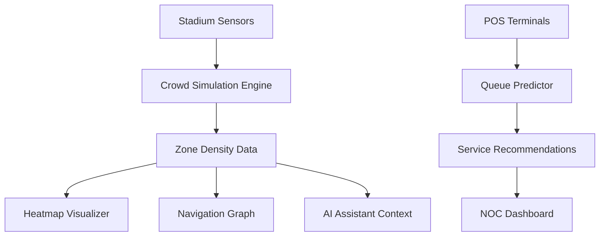

# 🏟️ ArenaMind AI — Next-Gen Stadium Operating System

> **ArenaMind AI** is an intelligent, high-fidelity venue management platform that transforms the fan experience through live crowd digital twins, predictive queue analytics, and AI-driven spatial intelligence.

---

## 🛰️ Project Status: v2.0 "Cyber Stadium"

The latest update introduces a premium **Dark Industrial / Glassmorphism** design system, featuring a robust Network Operations Center (NOC) environment and enhanced real-time simulations.

---

## 🎯 Challenge Vertical

**Physical Event Experience** — Enhancing the journey of thousands of attendees at high-capacity venues through spatial awareness and AI-powered coordination.

---

## 💡 The Problem

Large stadiums face massive logistical hurdles:
- **Spatial Bottlenecks**: Dangerous density at specific gates while others remain empty.
- **Queue Fatigue**: Unpredictable wait times for amenities (food, restrooms).
- **Communication Gaps**: Fans lack real-time context to make informed decisions.
- **Emergency Latency**: Slower evacuation response due to a lack of live crowd-flow data.

---

## ✨ Key Modules

### 🚨 Command Center (NOC Dashboard)
- **High-Density Stats**: Live attendee counts, avg wait times, and active alerts.
- **System Status Log**: Real-time background telemetry feed showing sensor heartbeats and system calibration.
- **Interactive Ticker**: A futuristic top-bar newsreel displaying live match events (Goals, Substitutions) and stadium-wide announcements.

### 📡 Radar Heatmap & Topology
- **Infrared Radar Sweep**: A cinematic scanning animation over the SVG stadium topology.
- **Dynamic Heatmapping**: 15 stadium zones monitored every 5 seconds.
- **Digital Twin Fallback**: When Maps API is offline, the system defaults to a high-fidelity SVG topology reflecting live density.

### ⏱️ AI Queue Predictor
- **Predictive Analytics**: Algorithmic wait times (`Queue Length ÷ Service Rate`).
- **Optimal Choice Engine**: Automatically highlights the fastest facility in each category.

### 🧭 Smart Routes & Navigation
- **Topological Routing**: Pathfinding that proactively avoids "Red" (High Density) zones.
- **Spatial Reasoning**: Explains *why* a route was chosen (e.g., "Avoiding Gate A due to congestion").

### 🤖 AI Arena Assistant
- **Contextual NLP**: Analyzes live stadium data to answer complex fan queries.
- **Suggestion Chips**: One-tap "Quick Ask" buttons for common queries (Fastest Pizza, Safe Exit).
- **Thinking Waveform**: Visual feedback for data processing states.

### 📦 Seat-Side Logistics
- **Contactless Ordering**: Full menu with multi-stage real-time order tracking (Preparing → Out for Delivery).

---

## 🏗️ System Architecture



---

## 🛠️ Technical Implementation

- **Foundation**: Zero-dependency Vanilla JS (ES6+), HTML5 Semantic Shell.
- **Styling**: Premium Glassmorphism design system using CSS Variables and 3D-tilt interactions.
- **Mapping**: Dynamic injection of **Google Maps JavaScript API** with automatic SVG fallback logic.
- **Performance**: Optimized rendering loops (<50ms execution time) with throttled 5s data refreshes.

---

## 📁 Project Structure

```
arena-mind-ai/
├── index.html      # Application Shell & UI Sections
├── style.css       # 'Cyber Stadium' Design System v2.0
├── main.js         # Core Intelligence & Simulation Engine
└── README.md       # Technical Documentation
```

---

## 🚀 Quick Start

1.  **Clone the Repo**: `git clone https://github.com/your-repo/arenamind-ai`
2.  **Run**: Just open `index.html` in any modern browser.
3.  **Live Mode**: Click the **Settings (⚙️)** in the Map section to add your Google Maps API key for satellite views.

---

## 👨‍💻 Author

Built with ❤️ for **Prompt Wars Virtual**
#BuildwithAI #PromptWarsVirtual

*ArenaMind AI — Making Every Fan's Journey Seamless* 🏟️
